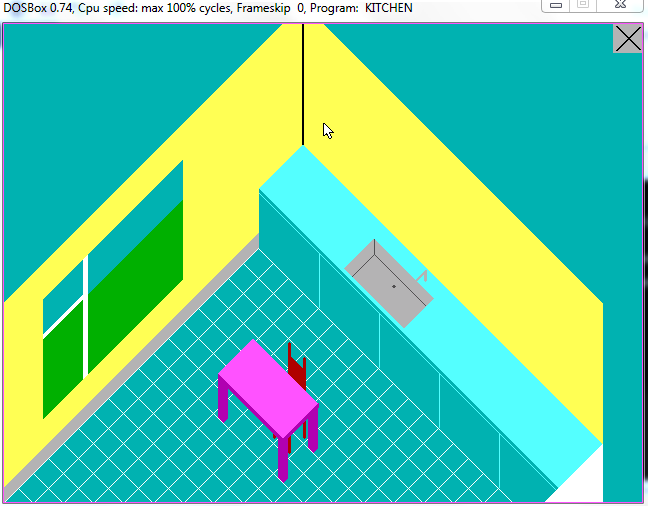
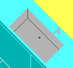
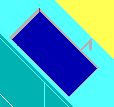
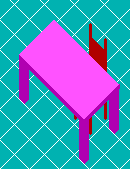
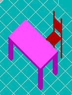
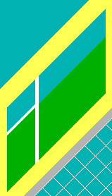
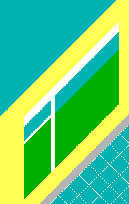
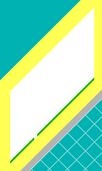

<h1>KITCHEN_ASM</h1>
 
This is a project where the requirements were to draw a kitchen using an assembly language(8086), have 3 clickable items, and at least 1 animation. This is my final submission where the kitchen is drawn from an axonometric perspective.
 
<h2>Screenshots</h2>

<h4>Sink</h4>

<h4>Table & Chair</h4>

<h4>Window Blinds</h4>

